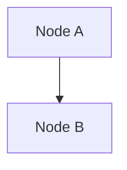

# Prodkit Create Diagram Skill

## User Input

```text
$ARGUMENTS
```

The user provides either a source file path or source content to convert into Mermaid.

## Overview

Run the conversion in five stages:

1. Resolve input and source type
2. Validate source content
3. Build Mermaid graph
4. Resolve output path (non-overwrite)
5. Write artifact and report result

---

## Stage 1 - Resolve Input and Source Type

1. Parse `$ARGUMENTS` for:
   - source file path, or
   - inline source content.
2. Determine source type:
   - `architecture` (from `/prodkit.architecture` output), or
   - `dataflow` (from `/prodkit.dataflow` output; `prodkit.dataflowdiagram` is deprecated naming).
3. If no usable source can be resolved, stop with:
   - `Missing input: provide a source artifact path or inline architecture/dataflow content.`

---

## Stage 2 - Validate Source Content

Before generation, verify:

- source exists and is readable (if file-based)
- content is not empty
- relationships/directions are present or inferable
- payload/edge meaning is sufficiently clear

If validation fails, return actionable errors and stop:

- unreadable path -> `Source file is not readable: <path>`
- empty content -> `Source content is empty. Add components and relationships.`
- unsupported content -> `Unsupported input format. Provide architecture or dataflow content.`
- ambiguous relationships -> `Ambiguous relationships detected. Clarify direction and payloads.`

No output file should be written on validation failure.

---

## Stage 3 - Build Mermaid Graph

1. Default graph header: `flowchart TD`.
2. Build node set from services/components/entities.
3. Build edges from explicit or inferred relationships.
4. Enforce minimum valid diagram:
   - at least 1 node
   - at least 1 edge
5. Wrap final diagram in a Markdown Mermaid block:



If graph construction cannot satisfy minimum validity, fail with:
`Could not produce a valid Mermaid graph (requires at least one node and edge).`

---

## Stage 4 - Resolve Output Path

1. Use source artifact directory as output directory.
2. Default filename:
   - `architecture-diagram.mmd.md` for architecture sources
   - `dataflow-diagram.mmd.md` for dataflow sources
3. If target exists, apply deterministic suffixing without overwrite:
   - `*-1.mmd.md`, `*-2.mmd.md`, ...
4. If output directory is not writable, fail with:
   - `Cannot write output in source directory: <directory>`

---

## Stage 5 - Write Artifact and Report Result

On success:

- write diagram file
- return:
  - generated file path
  - detected source type
  - whether a collision suffix was used

Success message format:

`Created Mermaid diagram: <path> (source: <architecture|dataflow>)`

Failure message format:

`Diagram generation failed: <actionable reason>`

---

## Summary Output

```
-- prodkit.create diagram summary ------------------
Source: <path or inline>          [architecture|dataflow]
Validated:                        [yes|no]
Output:  <path>                   [created|skipped]
Notes:   <collision suffix / error message>
---------------------------------------------------
```
